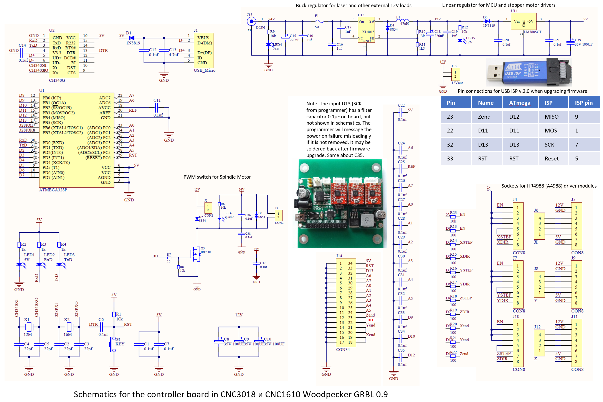

# CNC_IAR

El cnc del iar consta de la placa denominada '' WOODPECKER CNC GRBL 0.9". La placa se muestra a continuación, en conjunto con su esquemático:

A esta placa se le 
extrae el firmware de la misma, con las siguientes herramientas: 
 - [USBasp]("www.google.com")  
 - Cables Dupont 

El conexionado es el siguiente 

MOSI --- MOSI  
MISO --- MISO  
RST --- RST      
SCK --- SCK      

